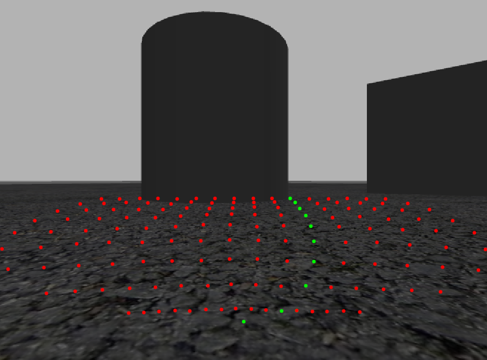

# 📷 Image Path Planning
> ROS2 based local planning package designed to work with RGBD cameras. 

<p align="middle"> </p>


The image planner considers optimal trajectories in a short term horizon within in the image space, removing the need of local cost map generation.

## Requirements
- Ubuntu 20.04 
- [ROS2 Foxy Fitzroy](https://docs.ros.org/en/foxy/Installation.html) 
- [Gazebo](https://classic.gazebosim.org/tutorials?tut=ros_installing&cat=connect_ros) 

## Installing 
Within the `src` directory of a ROS2 workspace (e.g. `/colcon_ws`):
```shell
git clone https://github.com/SuryaKannan/image_path_planning.git --recurse-submodules
cd .. && rosdep install --from-paths src --ignore-src -r -y
colcon build
source install/setup.bash
echo "export LINOROBOT2_BASE=4wd" >> ~/.bashrc
source ~/.bashrc
```

## Quick Start
### 1) Launch Linorobot2 Gazebo environment
```shell
ros2 launch linorobot2_gazebo gazebo.launch.py
```


### 2) Launch Image Planner
```shell
ros2 launch image_planner image_planner.launch.py rviz:=true
```

### 3) Select a Goal Pose using RVIZ 

## Packages

### ROS2 API 

### [waypoint_publisher](/waypoint_generator/waypoint_generator/waypoint_publisher_node.py)

#### Published Topics

`~/local_waypoint_markers` (**MarkerArray**)<br/>
Visualisable Marker Array

`~/local_waypoints`(**WaypointArray**)<br/>
Array of all waypoints

`~/local_waypoint_info`(**WaypointInfo**)<br/>
Number of trajectories and number of waypoints per trajectory

#### Subscribed Topics

`~/camera/depth/camera_info`(**CameraInfo**)<br/>
All intrinsic camera parameters 

#### Parameters

`~offset`<br/>
Distance which waypoints start from camera frame 

`~num_trajectories`<br/>
Number of trajectories  

`~sampling_points`<br/>
Number of samples per trajectory 

&nbsp;

### [tentacle_planner](/image_planner/image_planner/tentacle_planner_node.py)
#### Published Topics

`~/waypoint_overlay`(**Image**)<br/>
Image with Projected Waypoints 

`~/tentacle_selection`(**Tentacle**)<br/>
Optimal trajectory based on minimum number of collisions and closest Euclidian distance to goal pose

#### Subscribed Topics

`~/camera/depth/image_rect_raw`(**Image**)<br/>
Depth images, follows [REP118](https://www.ros.org/reps/rep-0118.html) Standard

`~/camera/color/image_raw`(**Image**)<br/>
Raw image

`~/tf_static`(**TFMessage**)<br/>
All static tfs, used to find base_link to camera_frame extrinsic transform

`~/tf`(**TFMessage**)<br/>
All dynamic tfs, used to track odometry

`~/camera/depth/camera_info`(**CameraInfo**)<br/>
All intrinsic camera parameters 

`~/local_waypoints`(**WaypointArray**)<br/>
Array of all waypoints

`~/local_waypoint_info`(**WaypointInfo**)<br/>
Number of trajectories and number of waypoints per trajectory

`~/goal_pose`(**PoseStamped**)<br/>
Goal position chosen

#### Parameters

`~crit_dist`<br/> 
Acceptable threshold used to compare desired depth and measured depth when calculating number of collisions

&nbsp;

### [control](/controller/controller/control_node.py)

#### Published Topics

`~/cmd_vel`(**Twist**)<br/>
Set linear and angular velocity of the robot 

#### Subscribed Topics

`~/tentacle_selection`(**Tentacle**)<br/>
Optimal trajectory based on minimum number of collisions and closest Euclidian distance to goal pose

`~/goal_pose`(**PoseStamped**)<br/>
Goal position chosen

`~/local_waypoints`(**WaypointArray**)<br/>
Array of all waypoints

`~/local_waypoint_info`(**WaypointInfo**)<br/>
Number of trajectories and number of waypoints per trajectory

`~/odom`(**Odometry**)<br/>
Current Pose of the robot relative to base_link

#### Parameters


`~y_arc`<br/>
Desired radius based on waypoint sampling (i.e. take y_arc index for each trajectory as reference radius when choosing steering angle)

`~goal_range`<br/>
How close to get to goal before stopping

`~max_speed `<br/>
Maximum speed of the vehicle

`~slow_dist`<br/>
Distance at which to start following a parabolic braking profile


## Acknowledgements

### [linorobot2](https://github.com/linorobot/linorobot2)
- ROS2 port of the [linorobot](https://github.com/linorobot/linorobot) package. Helps to build a custom ROS2 robot (2WD, 4WD, Mecanum Drive) using accessible parts. Able to easily verify experiments on a virtual robot in Gazebo
### [ros2_numpy](https://github.com/Box-Robotics/ros2_numpy/tree/743513e56e3f35aa91ce07799de4b0f2f59f88c0)
- tools for converting ROS messages to and from numpy arrays for ROS2

## Troubleshooting Guide

| Issue  | Solution |
| ------------- | ------------- |
| Gazebo simulation isn't launching  | Remove the build, log and install files and re-run colcon build WITHOUT the --symlink-install flag. If you are connected to a LAN with other computers running ROS2, make sure you have a different ROS_DOMAIN_ID. The last thing to try is to use ```$ killall gzserver``` in the event there are background processes still running that haven't exited cleanly|
| RuntimeWarning: invalid value encountered in double_scalars m = (point2[1]-point1[1])/(np.cosh(point2[0])-np.cosh(point1[0]))  | Ensure the [number of trajectories chosen](/waypoint_generator/waypoint_generator/waypoint_publisher_node.py) is even. If still this warning appears with no visualisable waypoints in RVIZ, re-run the launch file |
| No Waypoints spawn and no image appears  | Relaunch the image planner launch file. You may need to do this several times. Try to disable Visualisation to help |

&nbsp;

## Authors

Surya Kannan - thesuryakannan@gmail.com
